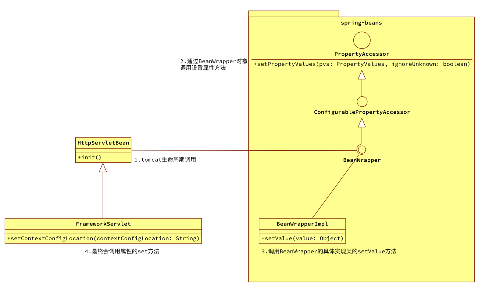
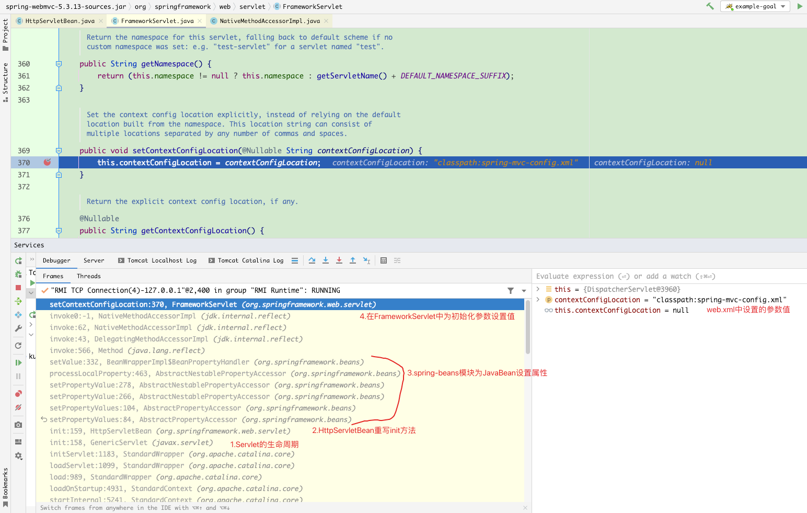
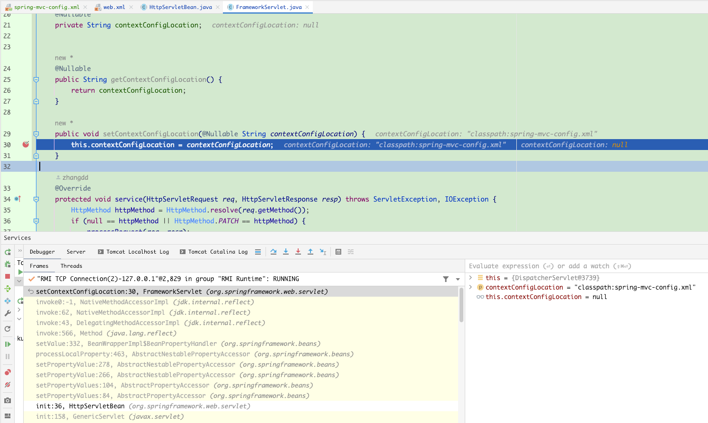
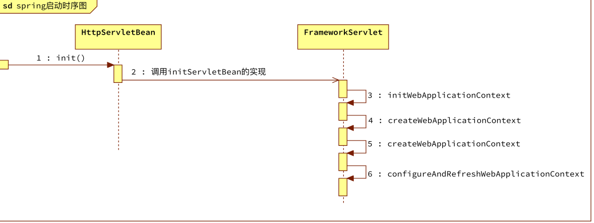
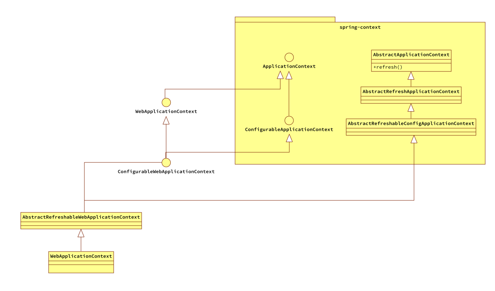
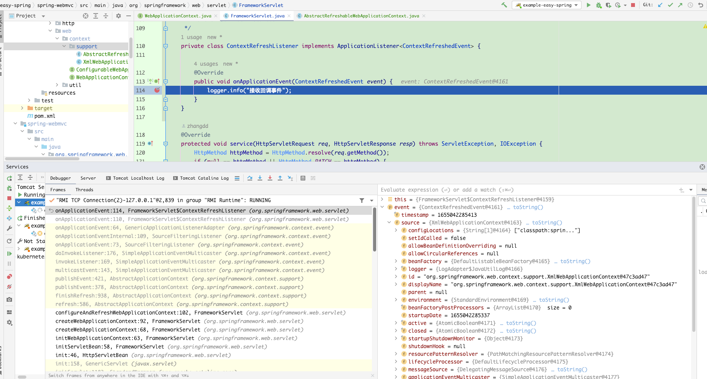

# 内容概览

- 配置Servlet初始化参数`contextConfigLocation`，FrameworkServlet获取设置的参数值
- 启动spring生命周期，并注册回调监听

# 为Servlet设置初始化参数，同时FrameworkServlet获取初始化的参数值

到目前为止上篇创建的DispatcherServlet类和spring还没半毛钱的关系，最多就是包名和类名相同了。既然要使用spring那么spring的配置文件必然少不了且该配置文件是通过Servlet的初始化参数设置的。

```xml
<?xml version="1.0" encoding="UTF-8"?>
<web-app xmlns="http://xmlns.jcp.org/xml/ns/javaee"
         xmlns:xsi="http://www.w3.org/2001/XMLSchema-instance"
         xsi:schemaLocation="http://xmlns.jcp.org/xml/ns/javaee http://xmlns.jcp.org/xml/ns/javaee/web-app_4_0.xsd"
         version="4.0">


    <!--    设置Springmvc前端处理器-->
    <servlet>
        <servlet-name>DispatcherServlet</servlet-name>
        <servlet-class>org.springframework.web.servlet.DispatcherServlet</servlet-class>
        <!--设置Servlet初始化参数-->
        <init-param>
            <param-name>contextConfigLocation</param-name>
            <param-value>classpath:spring-mvc-config.xml</param-value>
        </init-param>
        <!--指定Servlet启动顺序-->
        <load-on-startup>1</load-on-startup>
    </servlet>

    <servlet-mapping>
        <servlet-name>DispatcherServlet</servlet-name>
        <url-pattern>/*</url-pattern>
    </servlet-mapping>

</web-app>

```

还是在web.xml中通过init-param为Servlet设置初始化参数。获取参数时会用到下列方法

- getInitParameter(String name)    //获取初始化参数值
- getInitParameterNames()    //以String对象的Enumeration的形式返回 servlet的初始化参数的名称
- getServletName()    //返回此 servlet 实例的名称

初始化参数`contextConfigLocation`在spring体系里是由FrameworkServlet维护的。设置流程如下图：



1. HttpServletBean重写了Servlet的init方法，所以会在tomcat启动的生命周期里执行
2. 在init方法中将获取到的初始化参数调用spring-beans模块中的属性访问器功能模块去设置到对应的位置
   1. BeanWrapper相当于一个代理器，提供了为JavaBean设置获取属性的功能
3. 初始化参数contextConfigLocation的set方法在FrameworkServlet类中维护

debug查看其调用栈如下图：



## 代码实现

### HttpServletBean的init方法

```java
    @Override
    public void init() throws ServletException {
        //1.获取Servlet设置的初始化参数
        PropertyValues pvs = new ServletConfigPropertyValues(getServletConfig(), this.requiredProperties);
        if (!pvs.isEmpty()) {

            try {
                BeanWrapper bw = PropertyAccessorFactory.forBeanPropertyAccess(this);
                //2.这里将获取到的参数交给bw去设置到对应的set方法
                bw.setPropertyValues(pvs, true);
            } catch (BeansException e) {
                if (logger.isErrorEnabled()) {
                    logger.error("Failed to set bean properties on servlet '" + getServletName() + "'", e);
                }
                throw e;
            }
        }

        //3.在初始化参数处理完成后，调用模版方法让子类进行初始化
        initServletBean();
    }

    /**
     * Subclasses may override this to perform initialization. All bean
     * properties of this servlet will have been set before this method is invoked.
     */
    protected void initServletBean() throws ServletException {

    }
```

1. ServletConfigPropertyValues是个内部类，去获取为Servlet配置的初始化参数，同时校验是否设置了必要的参数。requiredProperties是一个Set集合可以设置约束哪些参数是必要的，如果没有设置则Servlet启动失败

2. 将获取到的参数键值对交给BeanWrapper为处理。这里省略了部分暂时不用到的代码。
3. 在初始化参数设置完成后，调用定义的模版方法initServletBean进行下一步的操作

### FrameworkServlet的setContextConfigLocation方法

在web.xml中设置的初始化参数key为`contextConfigLocation`，所以就必须有对应的get、set方法

- getContextConfigLocation
- setContextConfigLocation

```java
    @Nullable
    private String contextConfigLocation;


    @Nullable
    public String getContextConfigLocation() {
        return contextConfigLocation;
    }

    public void setContextConfigLocation(@Nullable String contextConfigLocation) {
        this.contextConfigLocation = contextConfigLocation;
    }
```

## 测试

debug启动`example-easy-spring`可以看到setContextConfigLocation方法被调用



# 启动spring生命周期，并注册回调监听

既然已经为spring设置了配置文件，那么必然得有调用的地方不然干嘛费尽周折进行设置。理所应当也就是在启动spring时调用getContextConfigLocation方法。

启动spring流程图如下所示：



1. HttpServletBean重写了Servlet的init方法，所以会按照Servlet的生命周期执行init方法。在init方法里处理完Servlet的初始化参数之后，会调用模版方法initServletBean
2. FrameworkServlet重写了initServletBean方法，经过层层处理在该类的configureAndRefreshWebapplicationContext方法里触发了spring的启动

## 代码实现

### FrameworkServlet中的系列方法

```java
protected WebApplicationContext createWebApplicationContext(@Nullable ApplicationContext parent) {
        //获取上下文的class对象，即XmlWebApplicationContext.class
        Class<?> contextClass = getContextClass();
        if (!ConfigurableWebApplicationContext.class.isAssignableFrom(contextClass)) {
            throw new ApplicationContextException(
                    "Fatal initialization error in servlet with name '" + getServletName() +
                            "': custom WebApplicationContext class [" + contextClass.getName() +
                            "] is not of type ConfigurableWebApplicationContext"
            );
        }

        //构造一个XmlWebApplicationContext对象
        ConfigurableWebApplicationContext wac = (ConfigurableWebApplicationContext) BeanUtils.instantiateClass(contextClass);

        wac.setParent(parent);

        //获取设置的spring配置文件
        String configLocation = getContextConfigLocation();
        if (null != configLocation) {
            wac.setConfigLocation(configLocation);
        }
        configureAndRefreshWebApplicationContext(wac);

        return wac;
    }

    protected void configureAndRefreshWebApplicationContext(ConfigurableWebApplicationContext wac) {

        //注册回调监听
        wac.addApplicationListener(new SourceFilteringListener(wac, new ContextRefreshListener()));

        wac.refresh();
    }

    /**
     * ApplicationListener endpoint that receives events from this servlet's
     * WebApplicationContext only, delegating to onApplicationEvent on the
     * FrameworkServlet instance.
     */
    private class ContextRefreshListener implements ApplicationListener<ContextRefreshedEvent> {

        @Override
        public void onApplicationEvent(ContextRefreshedEvent event) {
            logger.info("接收回调事件");
        }
    }
```

默认情况下spring配置文件是交给web模块中的XmlWebApplicationContext来进行解析的。

其中refresh方法是启动spring的入口，在启动spring之前首先设置了spring配置文件然后注册了一个上下文监听事件。当spring启动之后会回调内部类实现的回调监听端点做后续的初始化操作。

## XmlWebApplicationContext的类结构

refresh方法真正的实现是在AbstractApplicationContext类中，这块逻辑在单独描述吧不属于当前的范围内。XmlWebApplicationContext算是应用上下文在web层面使用xml处理的一个类，是AbstractApplicationContext的子类所以可以调用refresh方法。



这里之所以把这个类关系图列出来主要是描述一点，在spring实现过程中有很多这种模式。一个类A实现了接口B，但是接口B中定义的方法却是让类A的父类C实现的。稍微有点绕抽象成简单的类关系之后代码如下：

```java
public interface Function {
    void speak();
}

public class Parent {

    public void speak(){

    }
}

public class Child extends Parent implements Function {


}

```

# 测试

debug启动`example-easy-spring`项目效果如下：


