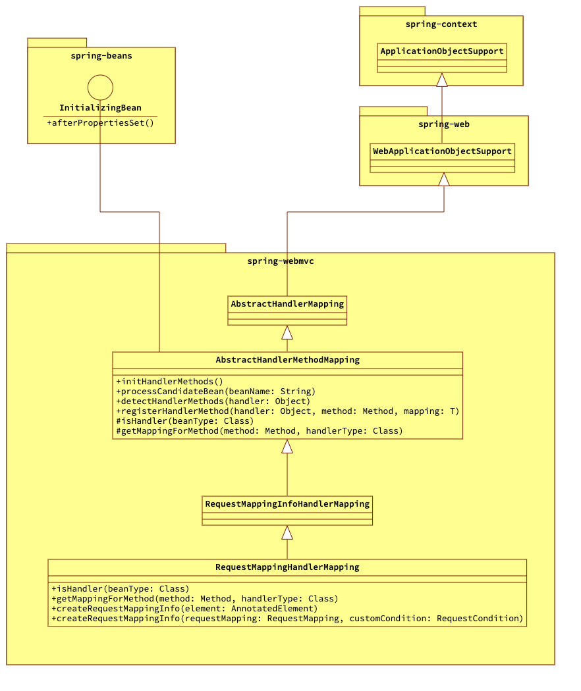
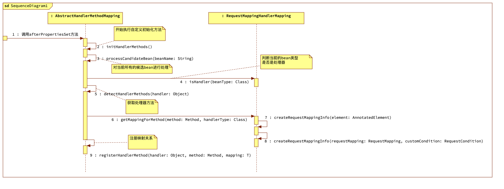

# 内容概览

- Spring中bean创建之后执行自定义初始化
- 获取当前所有的bean并过滤得到是处理器的bean
- 为业务Handler创建映射关系

# spring-beans的InitializingBean

InitializingBean这个接口是spring-beans模块内的接口。该接口定义中就一个方法：

```java
void afterPropertiesSet() throws Exception;
```

该方法在BeanFactory创建bean之后会被调用，因此可以通过实现该接口做自定义的初始化，或者校验必要的参数是否被设置。

# 创建Http请求和处理器Handler的映射关系的切入口

Http请求和处理器Handler的映射关系由处理器映射器HandlerMapping来维护，RequestMappingHandlerMapping是处理器映射器的一种实现，该类做了如下两件事情

1. 创建了Http请求和处理器Handler的映射
2. 当有Http请求时，可以通过Http请求获取到处理该请求的处理器

由于本篇只描述映射关系的创建，所以下面类关系图中没有体现RequestMappingHandlerMapping对HandlerMapping的实现：



1. RequestMappingHandlerMapping继承了AbstractHandlerMethodMapping，而AbstractHandlerMethodMapping就实现了InitializingBean接口
2. 所以当RequestMappingHandlerMapping这个Bean在被创建之后实现了InitializingBean接口中的方法afterPropertiesSet就会被调用

# RequestMappingHandlerMapping实例化之后的创建映射关系的执行流程

## 映射关系创建的时序图



## 主要代码

### AbstractHandlerMethodMapping实现的afterPropertiesSet

```java
    @Override
    public void afterPropertiesSet() throws Exception {
        initHandlerMethods();
    }
```

AbstractHandlerMethodMapping实现了InitializingBean的afterPropertiesSet方法，当被回调之后调用自己的初始化方法。

### AbstractHandlerMethodMapping的initHandlerMethods

```java
    protected void initHandlerMethods() {
        for (String beanName : getCandidateBeanNames()) {
            if (!beanName.startsWith(SCOPED_TARGET_NAME_PREFIX)) {
                processCandidateBean(beanName);
            }
        }
    }
```

获取所有的候选Bean，对候选的Bean进行循环遍历并简单的排除

### AbstractHandlerMethodMapping的processCandidateBean

```java
    protected void processCandidateBean(String beanName) {
        Class<?> beanType = null;

        try {
            beanType = obtainApplicationContext().getType(beanName);
        } catch (Throwable ex) {
            if (logger.isTraceEnabled()) {
                logger.trace("Could not resolve type for bean '" + beanName + "'", ex);
            }
        }
        if (beanType != null && isHandler(beanType)) {
            detectHandlerMethods(beanName);
        }
    }
```

对排除之后的候选Bean进行处理，这里会调用isHandler判断当前的Bean是否是处理器类型的Bean。如果是则会处理这个类中的方法。

### RequestMappingHandlerMapping的isHandler

```java
    @Override
    protected boolean isHandler(Class<?> beanType) {
        return AnnotatedElementUtils.hasAnnotation(beanType, Controller.class) ||
                AnnotatedElementUtils.hasAnnotation(beanType, RequestMapping.class);
    }
```

这个方法的逻辑还是很明了的，判断当前Bean的类型是否有Controller注解或者RequestMapping注解。这里就知道为什么业务Handler使用这两个注解标识之后就可以用来处理Http请求了。

### AbstractHandlerMethodMapping的detectHandlerMethods

```java
    protected void detectHandlerMethods(Object handler) {
        Class<?> handlerType = (handler instanceof String) ? obtainApplicationContext().getType(((String) handler)) : handler.getClass();

        if (null != handlerType) {
            Class<?> userType = ClassUtils.getUserClass(handlerType);
            Map<Method, T> methods = MethodIntrospector.selectMethods(userType, (MethodIntrospector.MetadataLookup<T>)
                    method -> getMappingForMethod(method, handlerType));

            methods.forEach((method, mapping) -> {
                Method invocableMethod = AopUtils.selectInvocableMethod(method, userType);
                registerHandlerMethod(handler, invocableMethod, mapping);
            });
        }
    }
```

对于是处理器的类，则获取该类的所有映射方法getMappingForMethod。得到所有方法之后进行遍历循环进行注册

### 获取RequestMappingInfo

```java
  @Override
    @Nullable
    protected RequestMappingInfo getMappingForMethod(Method method, Class<?> handlerType) {
        RequestMappingInfo info = createRequestMappingInfo(method);
        if (null != info) {
            RequestMappingInfo typeInfo = createRequestMappingInfo(handlerType);
            if (null != typeInfo) {
                info = typeInfo.combine(info);
            }
        }
        return info;
    }

    @Nullable
    private RequestMappingInfo createRequestMappingInfo(AnnotatedElement element) {
        RequestMapping requestMapping = AnnotatedElementUtils.findMergedAnnotation(element, RequestMapping.class);
        RequestCondition<?> condition = element instanceof Class ?
                getCustomTypeCondition((Class<?>) element) :
                getCustomMethodCondition((Method) element);
        return null != requestMapping ? createRequestMappingInfo(requestMapping, condition) : null;
    }
```

首先根据方法获取RequestMapping信息封装成RequestMappingInfo，然后再获取当前类上的RequestMapping信息，因为RequestMapping既可以作用在方法上又可以作用在类上，当两者上面都有时，需要将两者合并起来。

# 其他

注册的流程虽然很简单，但是注册的过程需要注意的地方确实很多。特别是RequestMappingInfo的构造，这里先认识下它，在后面根据Http请求查找映射的处理器时还会用到它。