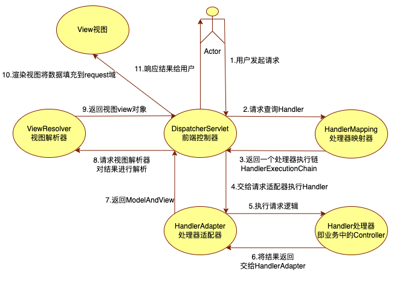
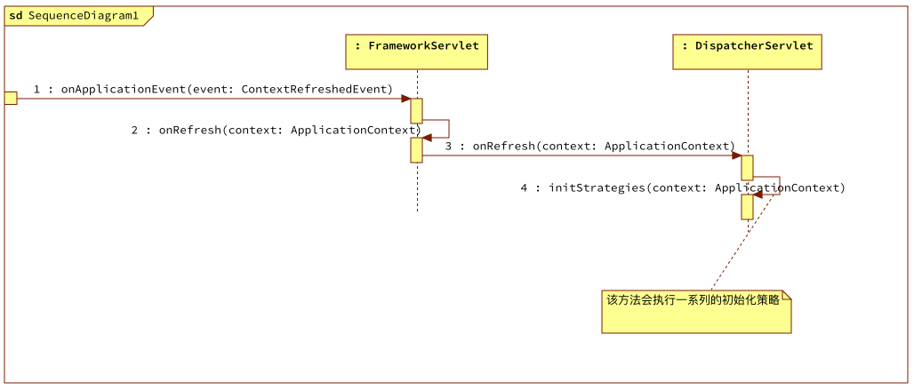

# 内容概览

- 流程回顾及后续规划
- 接收到spring之后回调之后的初始化策略

# 流程回顾及后续规划

- 到目前为止Http请求都交给了DispatcherServlet来进行处理
- 启动了spring的生命周期并接收到了上下文启动后的回调
- 注册了RequestMapping和Handler的映射关系

**接下来就是准备接收Http请求及响应也就是springmvc的执行流程**

- 根据接收到的Http请求查找对应的Handler
- 调用Handler处理逻辑
- 返回结果



那需要解决的问题就是怎么去查找，如何去调用，怎么返回结果。这些问题依靠DispatcherServlet定义的策略

# DispatcherServlet的初始化策略



1. FrameworkServlet接收到了spring上下文启动后的回调之后调用自定义的处理事件方法

2. onApplicationEvent方法内加锁调用模版方法onRefresh

3. DispatcherServlet实现了模版方法onRefresh

4. onRefresh方法会调用初始化策略方法，在该方法里会有一系列的初始化操作

   ```java
   	protected void initStrategies(ApplicationContext context) {
   		initMultipartResolver(context);
   		initLocaleResolver(context);
   		initThemeResolver(context);
   		initHandlerMappings(context);
   		initHandlerAdapters(context);
   		initHandlerExceptionResolvers(context);
   		initRequestToViewNameTranslator(context);
   		initViewResolvers(context);
   		initFlashMapManager(context);
   	}
   ```