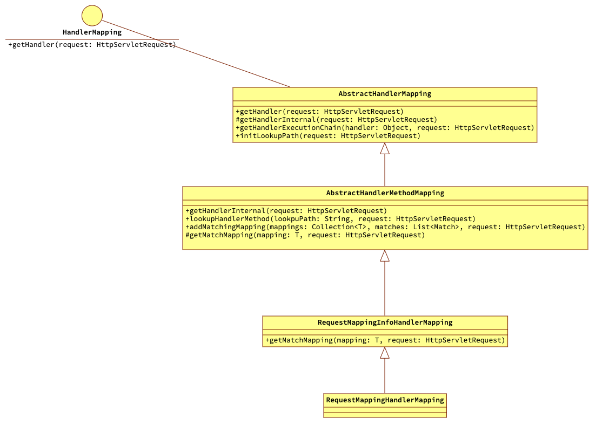
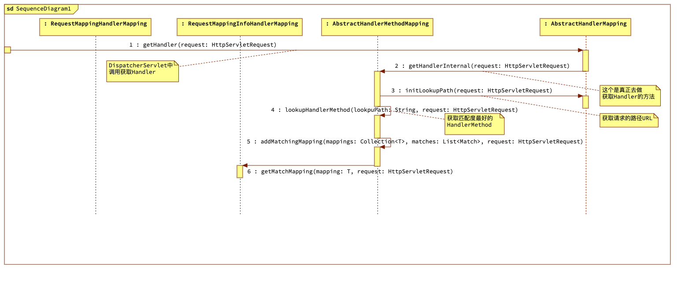
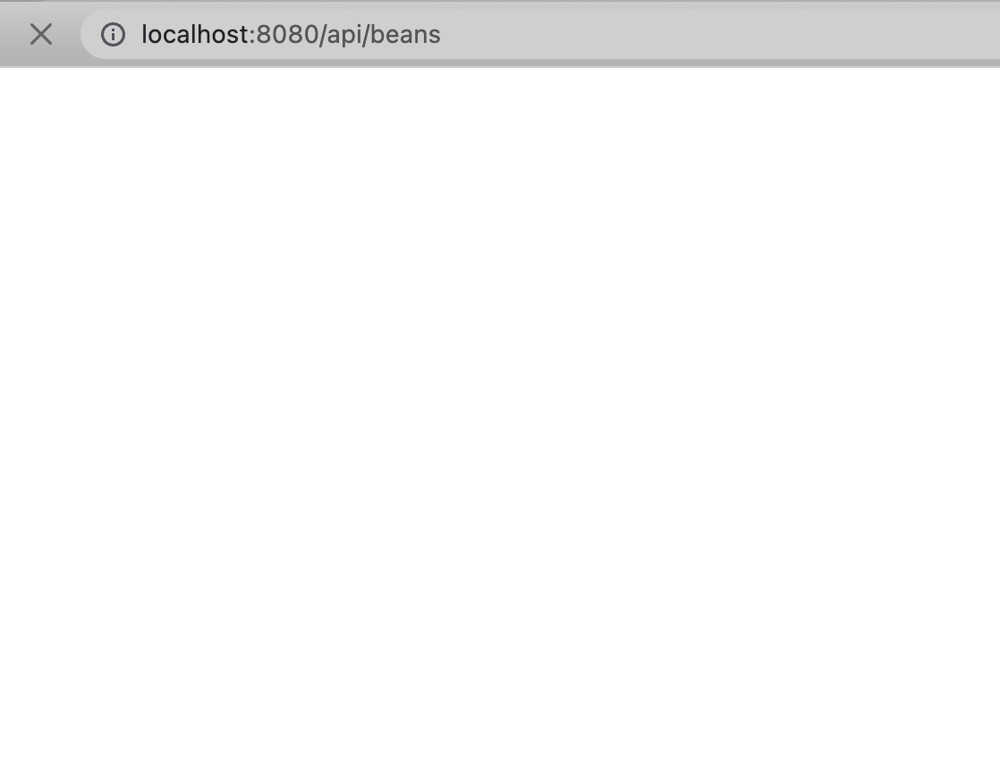
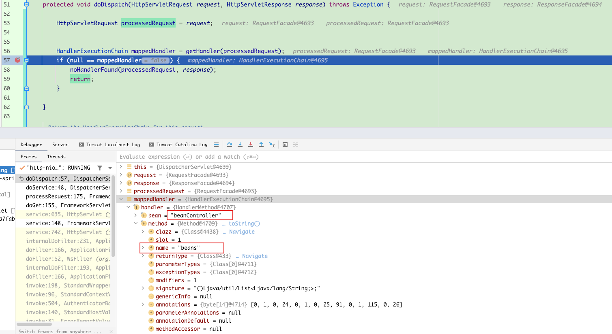

# 内容概览

- 初始化HandlerMapping
- 根据request获取对应的HandlerExecutionChain
- RequestMappingHandlerMapping体系实现获取HandlerExecutionChain

# 初始化HandlerMapping

前面注册RequestMapping和Handler的映射关系时声明的RequestMappingHandlerMapping就是HandlerMapping的一个实现。该接口中定义了一个方法getHandler就是返回当前请求的Handler或者拦截器。这个匹配的过程可能取决于请求的URL、session的状态或者其他的原因，由具体的实现决定。如果找到匹配结果就会返回一个HandlerExecutionChain对象，HandlerExecutionChain封装了Handler和拦截器。

```java
    /**
     * Return a handler and any interceptors for this request.
     */
    @Nullable
    HandlerExecutionChain getHandler(HttpServletRequest request) throws Exception;
```

## DispatcherServlet的initHandlerMappings

在DispatcherServlet类中的initHandlerMappings就是获取上下文中的HandlerMapping。这里做了简化没有对获取不到使用默认策略进行展示。

```java
    private void initHandlerMappings(ApplicationContext context) {
        this.handlerMappings = null;
        //Find all HandlerMappings in the ApplicationContext, including ancestor contexts.
        Map<String, HandlerMapping> matchingBeans =
                BeanFactoryUtils.beansOfTypeIncludingAncestors(context, HandlerMapping.class, true, false);
        if (!matchingBeans.isEmpty()) {
            this.handlerMappings = new ArrayList<>(matchingBeans.values());
            //We keep HandlerMappings in sorted order.
            AnnotationAwareOrderComparator.sort(this.handlerMappings);
        }
    }
```

# 根据request获取对应的HandlerExecutionChain

现在的DispatcherServlet已经匹配了所有的Http请求，并且交给方法doDispatch方法去处理，因此在该方法中首先就是获取当前请求的Handler。

```java
    protected void doDispatch(HttpServletRequest request, HttpServletResponse response) throws Exception {

        HttpServletRequest processedRequest = request;


        HandlerExecutionChain mappedHandler = getHandler(processedRequest);
        if (null == mappedHandler) {
            noHandlerFound(processedRequest, response);
            return;
        }

    }

    /**
     * Return the HandlerExecutionChain for this request.
     */
    @Nullable
    protected HandlerExecutionChain getHandler(HttpServletRequest request) throws Exception {
        if (null != this.handlerMappings) {
            for (HandlerMapping mapping : this.handlerMappings) {
                HandlerExecutionChain handler = mapping.getHandler(request);
                if (null != handler) {
                    return handler;
                }
            }
        }
        return null;
    }
```

这两小块代码就是获取Handler的主干，具体详细的获取操作交给HandlerMapping的实现体系。

# RequestMappingHandlerMapping体系实现获取HandlerExecutionChain

## RequestMappingHandlerMapping类结构图



## 根据请求获取Handler的流程图



## AbstractHandlerMapping的getHandler方法

```java
    @Override
    public HandlerExecutionChain getHandler(HttpServletRequest request) throws Exception {
        Object handler = getHandlerInternal(request);

        return getHandlerExecutionChain(handler, request);
    }

    protected HandlerExecutionChain getHandlerExecutionChain(Object handler, HttpServletRequest request) {

        return handler instanceof HandlerExecutionChain ?
                (HandlerExecutionChain) handler :
                new HandlerExecutionChain(handler);
    }
```

DispatcherServlet中会调用getHandler方法。AbstractHandlerMapping实现了HandlerMapping的getHandler方法，然后调用模版方法getHandlerInternal获取当前请求匹配的handler。最后将获取到的Handler包装成HandlerExecutionChain。

## AbstractHandlerMethodMapping实现的getHandlerInternal

```java
    @Override
    @Nullable
    protected HandlerMethod getHandlerInternal(HttpServletRequest request) throws Exception {
        String lookupPath = initLookupPath(request);
        HandlerMethod handlerMethod = lookupHandlerMethod(lookupPath, request);
        return null != handlerMethod ? handlerMethod.createWithResolvedBean() : null;
    }
```

- 首先调用父类方法initLookupPath获取当前请求的URL，实际上调用的是UrlPathHelper类中的方法。
- 然后调用lookupHandlerMethod根据请求URL获取最佳匹配的HandlerMethod
- 最后就是返回HandlerMethod或者null

## AbstractHandlerMethodMapping的lookupHandlerMethod方法

```java
    /**
     * Look up the best-matching handler method for the current request. If multiple
     * matches are found, the best match is selected.
     */
    @Nullable
    protected HandlerMethod lookupHandlerMethod(String lookupPath, HttpServletRequest request) throws Exception {
        List<Match> matches = new ArrayList<>();
        //1.根据请求URL获取RequestMappingInfo
        List<T> directPathMatches = this.mappingRegistry.getMappingsByDirectPath(lookupPath);
        if (null != directPathMatches) {
            //2.从RequestMappingInfo中构造Match放到matches中
            addMatchingMapping(directPathMatches, matches, request);
        }
        if (matches.isEmpty()) {
            addMatchingMapping(this.mappingRegistry.getRegistration().keySet(), matches, request);
        }
        //3.获取最佳匹配的结果
        if (!matches.isEmpty()) {
            Match bestMatch = matches.get(0);

            request.setAttribute(BEST_MATCHING_HANDLER_ATTRIBUTE, bestMatch.getHandlerMethod());
            handleMatch(bestMatch.mapping, lookupPath, request);
            return bestMatch.getHandlerMethod();
        } else {
            //返回没有匹配的结果
            return handleNoMatch(this.mappingRegistry.getRegistration().keySet(), lookupPath, request);
        }
    }

    private void addMatchingMapping(Collection<T> mappings, List<Match> matches, HttpServletRequest request) {
        for (T mapping : mappings) {
            T match = getMatchingMapping(mapping, request);
            if (null != match) {
                matches.add(new Match(match, this.mappingRegistry.getRegistration().get(mapping)));
            }
        }
    }
```

1. this.mappingRegistry是AbstractHandlerMethodMapping的内部类MappingRegistry，MappingRegistry维护了请求URL和RequestMappingInfo的关系。这个后面专门描述一下这个关系的创建及获取过程，这里只要知道是根据请求的URL从map中获取匹配的RequestMappingInfo即可。
2. 遍历匹配的RequestMappingInfo并从中构造Match放到matches中，遍历的过程会调用模版方法getMatchingMapping
3. 这里是获取最佳匹配的结果，这里简化了，实际上会进行compare获取最优的一个
4. 如果没有匹配的则返回对应的标识

## RequestMappingInfoHandlerMapping的getMatchingMapping

```java
    @Override
    protected RequestMappingInfo getMatchingMapping(RequestMappingInfo info, HttpServletRequest request) {
        return info.getMatchingCondition(request);
    }

```

这里只能说RequestMappingInfo维护了获取的逻辑。也留到RequestMappingInfo里一起描述吧。

# 测试

### **调用`example-easy-spring`中的测试接口**



### DispatcherServlet中断点查看

在DispatcherServlet中getHandler方法调用后面断点，可以看到获取到了beanController中的beans方法


