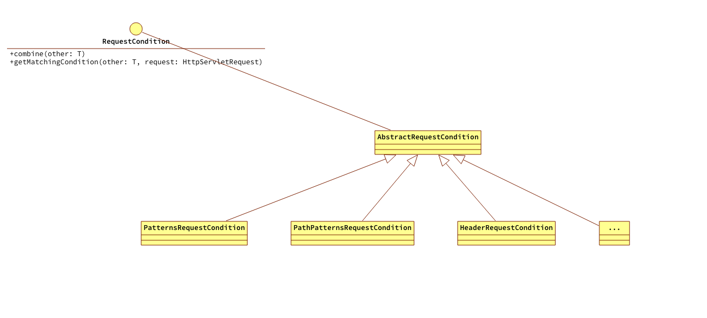
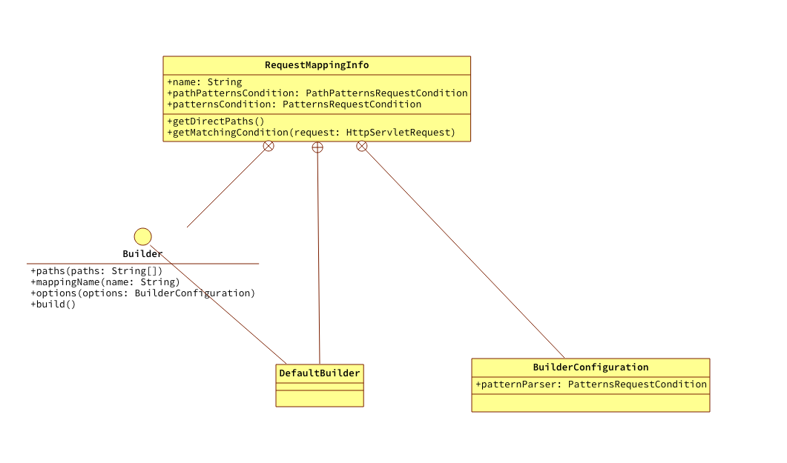
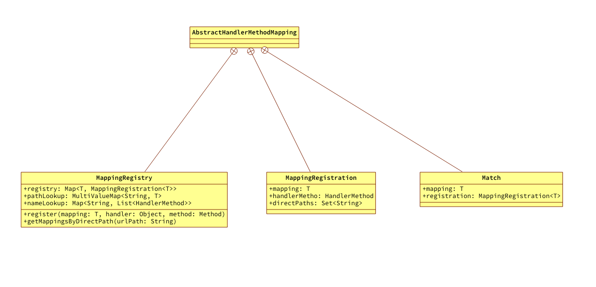

spring体系看起来复杂的原因之一就是其内部有很多为了解决某类问题而提取并实现的模型。在初始化HandlerMapping（RequestMappingHandlerMapping）时，要将RequestMapping注解申明的属性：请求路径、请求方法、请求头、请求参数、生产消费的MIME等存放起来，这些声明的属性信息不仅可以单独作用还可以相互结合作用。比如：同一个请求路径，不同的请求方法就是两个不同的业务场景。

# 内容概览

- RequestCondition（请求匹配条件）体系。

  上面提到的RequestMapping注解申明的属性与之呼应的就是spring中RequestCondition的实现体系。

- RequestMappingInfo体系

  RequestMappingInfo是请求映射信息的描述，维护了一个请求所匹配的各种条件。即一个请求是有很多匹配条件的都放在了RequestMappingInfo中

- RequestMappingInfo的生成、存放、和获取

# RequestCondition

*一个舒适的模式就是根据一个业务场景定义出一个功能接口，然后一个或多个抽象类实现该接口并完成主要的功能，最后就是具体实现类根据各自特点实现自己的特征。*

## 接口定义描述

```java
public interface RequestCondition<T> {

    /**
     * Combine this condition with another such as conditions from a type-level and
     * method-level {@code RequestMapping} annotation.
     */
    T combine(T other);

    /**
     * Check if the condition matches the request returning a potentially new
     * instance created for the current request. For example a condition with
     * multiple URL patterns may return a new instance only with those patterns that
     * match the request.
     */
    @Nullable
    T getMatchingCondition(HttpServletRequest request);
}

```

- combine方法就是多个条件相互结合的
- getMatchingCondition方法就是检查当前条件的实现与当前请求是否匹配

## 类关系



这里列举了三个具体的实现实际上并没有全部使用。

## PatternsRequestCondition的创建

PatternsRequestCondition的创建是随着创建RequestMappingInfo的创建而创建的。在RequestMappingInfo的内部类DefaultBuilder的build方法里

```java
        @Override
        public RequestMappingInfo build() {

            PathPatternsRequestCondition pathPatterns = null;
            PatternsRequestCondition patterns = null;

            if (null != this.options.patternParser) {
                pathPatterns = (ObjectUtils.isEmpty(this.paths)) ?
                        EMPTY_PATH_PATTERNS : new PathPatternsRequestCondition(this.options.patternParser, this.paths);
            } else {
                //1.创建PatternsRequestCondition
                patterns = (ObjectUtils.isEmpty(this.paths)) ?
                        EMPTY_PATTERNS :
                        new PatternsRequestCondition(this.paths, null, this.options.getPathMatcher(), false, false, null);
            }

            return new RequestMappingInfo(this.mappingName, pathPatterns, patterns);
        }
```

1. 这里走的是else逻辑。为什么是else逻辑，这个在创建RequestMappingInfo时会得出
2. this.paths就是RequestMapping里声明的接口url。所以正常情况下不会为空即使用paths创建PatternsRequestCondition然后再创建RequestMappingInfo
3. this.options也是RequestMapping中的一个内部类BuilderConfiguration，是创建RequestMappingInfo必须的一个内部类

这个过程就是在RequestMapping时，通过构造方法传递设置的PatternsRequestCondition。

# RequestMappingInfo

## RequestMappinginfo的类结构图



## 创建RequestMappinginfo

### RequestMappingHandlerMapping的createRequestMappingInfo

创建RequestMappingInfo是在RequestMappingHandlerMapping类中创建的，是在注册Handler阶段，可以翻下`04`篇的描述。

```java
	private RequestMappingInfo.BuilderConfiguration config = new RequestMappingInfo.BuilderConfiguration();

	protected RequestMappingInfo createRequestMappingInfo(RequestMapping requestMapping, @Nullable RequestCondition<?> customCondition{
        RequestMappingInfo.Builder builder = RequestMappingInfo
                .paths(requestMapping.path())
                .mappingName(requestMapping.name());

        if (null != customCondition) {
            builder.customCondition(customCondition);
        }
        return builder.options(this.config).build();
    }
```

由其类结构图可以知道是采用Builder模式创建。

### RequestMappingHandlerMapping#DefaultBuilder的build方法

```java
        public RequestMappingInfo build() {

            PathPatternsRequestCondition pathPatterns = null;
            PatternsRequestCondition patterns = null;

            if (null != this.options.patternParser) {
                pathPatterns = (ObjectUtils.isEmpty(this.paths)) ?
                        EMPTY_PATH_PATTERNS : new PathPatternsRequestCondition(this.options.patternParser, this.paths);
            } else {
                 //1.创建PatternsRequestCondition
                patterns = (ObjectUtils.isEmpty(this.paths)) ?
                        EMPTY_PATTERNS :
                        new PatternsRequestCondition(this.paths, null, this.options.getPathMatcher(), false, false, null);
            }

            return new RequestMappingInfo(this.mappingName, pathPatterns, patterns);
        }
```

在构造者模式的build方法里。默认设置传递的options的patternParser属性是空，所以走else逻辑块。

创建RequestMappingInfo的参数patterns，然后调用构造方法创建。

### RequestMappingInfo的构造方法

```java
    @Nullable
    private final String name;

    @Nullable
    private final PathPatternsRequestCondition pathPatternsCondition;

    @Nullable
    private final PatternsRequestCondition patternsCondition;


    public RequestMappingInfo(@Nullable String name,
                              @Nullable PathPatternsRequestCondition pathPatternsCondition, @Nullable PatternsRequestCondition patternsCondition) {
        Assert.isTrue(pathPatternsCondition != null || patternsCondition != null,
                "Neither PathPatterns nor String patterns condition");

        this.name = StringUtils.hasText(name) ? name : null;
        this.pathPatternsCondition = pathPatternsCondition;
        this.patternsCondition = patternsCondition;
    }
```

## 还剩余的两个方法

- getDirectPaths
- getMatchingCondition

这两个方法在获取Handler时会使用

# RequestMappingInfo的维护

RequestMappingInfo的维护是想表达，创建的RequestMappingInfo怎么存放，使用的时候怎么获取。RequestMappingInfo是在AbstractHandlerMethodMapping的系列内部类中维护的。

RequestMappingInfo的创建是在声明HandlerMapping阶段创建的，因为维护也在这个过程内。

## 类关系图



1. MappingRegistry相当于是入口，在register方法被调用时进行存放映射信息
2. registry存放RequestMappingInfo和MappingRegistration的映射
3. pathLookup是个一对多的关系，存放了请求路径和RequestMappingInfo的关系
4. nameLoopup也是个一对多的关系，存放的是name和HandlerMethod的关系

## 注册阶段

```java
        public void register(T mapping, Object handler, Method method) {
            this.readWriteLock.writeLock().lock();

            try {
                //1.根据Controller类和RequestMapping方法创建一个HandlerMethod
                HandlerMethod handlerMethod = createHandlerMethod(handler, method);
                //2.校验handlerMethod合法性
                validateMethodMapping(handlerMethod, mapping);
                //3.获取mapping也就是RequestMappingInfo中的path，也是RequestMapping注解声明的URL
                Set<String> directPaths = AbstractHandlerMethodMapping.this.getDirectPaths(mapping);
                //4.将URL和mapping放入一个map里，实际上是LinkedMultiValueMap
                for (String path : directPaths) {
                    this.pathLookup.add(path, mapping);
                }
                String name = null;
                if (null != getNamingStrategy()) {
                    name = getNamingStrategy().getName(handlerMethod, mapping);
                    addMappingName(name, handlerMethod);
                }
                //5.将mapping（RequestMappingInfo）和MappingRegistration的关系放入map里
                this.registry.put(mapping, new MappingRegistration<>(mapping, handlerMethod, directPaths, name, false));
            } finally {
                this.readWriteLock.writeLock().unlock();
            }

        }
```

1. 根据Controller类和RequestMapping方法创建一个HandlerMethod
2. 校验handlerMethod合法性，比如是否有重复等
3. 获取mapping也就是RequestMappingInfo中的path，也是RequestMapping注解声明的URL
4. 将URL和mapping放入一个map里，实际上是LinkedMultiValueMap
   1. 这里的LinkedMultiValueMap是spring内部实现的一个map，是个key:list的一对多结构
5. 将mapping（RequestMappingInfo）和MappingRegistration的关系放入map里

## 获取阶段

### AbstractHandlerMethodMapping的lookupHandlerMethod方法

```java
    @Nullable
    protected HandlerMethod lookupHandlerMethod(String lookupPath, HttpServletRequest request) throws Exception {
        List<Match> matches = new ArrayList<>();
        //1.根据请求路径获取RequestMappingInfo
        List<T> directPathMatches = this.mappingRegistry.getMappingsByDirectPath(lookupPath);
        if (null != directPathMatches) {
            addMatchingMapping(directPathMatches, matches, request);
        }
        if (matches.isEmpty()) {
            addMatchingMapping(this.mappingRegistry.getRegistration().keySet(), matches, request);
        }
        if (!matches.isEmpty()) {
            Match bestMatch = matches.get(0);

            request.setAttribute(BEST_MATCHING_HANDLER_ATTRIBUTE, bestMatch.getHandlerMethod());
            handleMatch(bestMatch.mapping, lookupPath, request);
            return bestMatch.getHandlerMethod();
        } else {
            return handleNoMatch(this.mappingRegistry.getRegistration().keySet(), lookupPath, request);
        }
    }


```

### RequestMappingInfo#MappingRegistry的getMappingsByDirectPath方法

```java
        @Nullable
        public List<T> getMappingsByDirectPath(String urlPath) {
            return this.pathLookup.get(urlPath);
        }
```

### AbstractHandlerMethodMapping的addMatchingMapping

```java
    private void addMatchingMapping(Collection<T> mappings, List<Match> matches, HttpServletRequest request) {
        //2.遍历当前URL获取到的RequestMappingInfo
        for (T mapping : mappings) {
            //3.调用获取新的RequestMappingInfo
            T match = getMatchingMapping(mapping, request);
            if (null != match) {
                //4.将匹配的内容放到集合里，this.mappingRegistry.getRegistration().get(mapping)
                matches.add(new Match(match, this.mappingRegistry.getRegistration().get(mapping)));
            }
        }
    }
```

### RequestMappingInfo的getMatchingCondition方法

```java
    @Override
    public RequestMappingInfo getMatchingCondition(HttpServletRequest request) {

        PathPatternsRequestCondition pathPatterns = null;
        if (null != this.pathPatternsCondition) {
            pathPatterns = this.pathPatternsCondition.getMatchingCondition(request);
            if (null == pathPatterns) {
                return null;
            }
        }

        PatternsRequestCondition patterns = null;
        if (null != this.patternsCondition) {
            patterns = this.patternsCondition.getMatchingCondition(request);
            if (null == patterns) {
                return null;
            }
        }
        return new RequestMappingInfo(this.name, pathPatterns, patterns);
    }
```

获取阶段是在根据当前请求获取Handler阶段中发生的，获取Handler的流程可以翻看`06`篇内容。

1. 根据请求路径也就是URL从map里获取存放的RequestMappingInfo
2. 循环遍历
3. 最终还是回到了RequestMappingInfo的getMatchingCondition方法。根据存放的信息进行匹配过滤，如果这个方法返回了null，对业务来说就是没有找到匹配的Handler

# 其他

这个过程是不仅又些复杂，同时也有很多细节功能。比如AntPathMatcher和PathPattern；以及UrlPathHelper中的各个工具方法；还有注册获取过程中在request的请求域内放置的缓存信息等。还是值得多看几遍的。