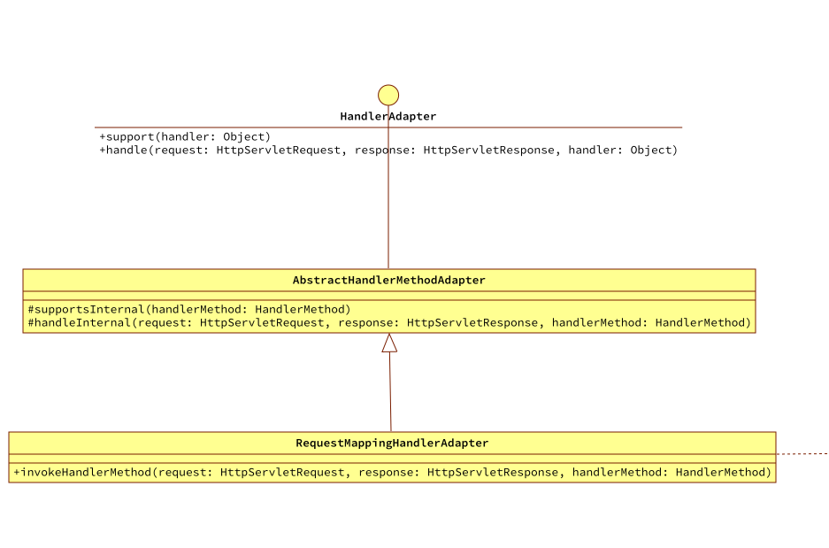
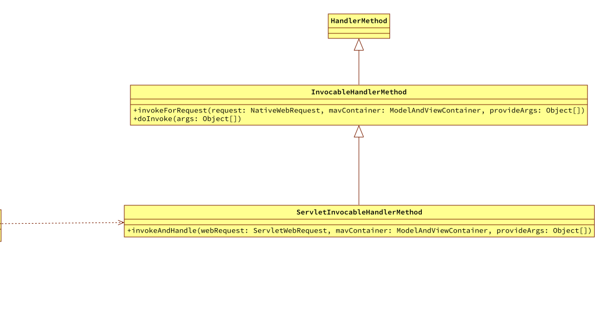
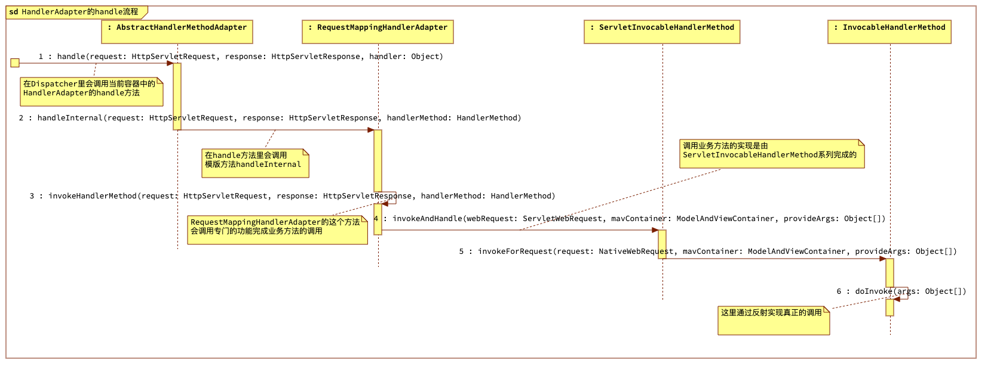

# 内容概览

到目前为止已经找为当前的HTTP请求找到了Handler或者HandlerExecution，接下来要实现的就是执行具体的业务方法。这个执行操作是由能处理此Handler的HandlerAdapter进行完成。

- HandlerAdapter介绍
- 实际应用使用的RequestMappingHandlerAdapter的初始化
- 从注册的HandlerAdapter列表中找到能处理当前找到的Handler的HandlerAdapter
- HandlerAdapter的执行

# HandlerAdapter介绍

从spring-mvc的执行流程介绍中知道HandlerAdapter的功能有以下两点：

1. 是否匹配当前的Handler或者HandlerExecution
2. 使用匹配的HandlerAdapter去调用执行

```java

    /**
     * Given a handler instance, return whether or not this HandlerAdapter can support
     * it. Typical HandlerAdapter will base the decision on the handler type.
     * HandlerAdapters will usually only support one handler type each.
     */
    boolean supports(Object handler);

    /**
     * Use the given handler to handle this request.The workflow that is required
     * may vary widely.
     */
    @Nullable
    ModelAndView handle(HttpServletRequest request, HttpServletResponse response, Object handler) throws Exception;
```

这里列出了HandlerAdapter的两个重要方法。

- 为当前的Handler找寻能够匹配的HandlerAdapter
- handle方法就是匹配当前Handler的HandlerAdapter调用去执行真正的业务执行逻辑。
  - 至于这个方法的返回值ModelAndView暂时不会使用到所以就不具体描述了。

# RequestMappingHandlerAdapter的逻辑

和HandlerMapping的使用实际是RequestMappingHandlerMapping类似，HandlerAdapter在案例中实际使用的是RequestMappingHandlerAdapter。

## RequestMappingHandlerAdapter类结构图



把类结构图精简出来发现还是那个老套路。HandlerAdapter接口定义了核心的方法，AbstractHandlerMethodAdapter实现接口完成统一的工作之后，在定义一系列模版方法，最后是具体的特性子类实现模版方法的逻辑。

### AbstractHandlerMethodAdapter的实现

```java
public abstract class AbstractHandlerMethodAdapter implements HandlerAdapter {


    protected abstract boolean supportsInternal(HandlerMethod handlerMethod);

    @Nullable
    protected abstract ModelAndView handleInternal(HttpServletRequest request, HttpServletResponse response, HandlerMethod handlerMethod) throws Exception;


    public AbstractHandlerMethodAdapter() {
    }

    @Override
    public boolean supports(Object handler) {
        return (handler instanceof HandlerMethod && supportsInternal(((HandlerMethod) handler)));
    }


    @Override
    public ModelAndView handle(HttpServletRequest request, HttpServletResponse response, Object handler) throws Exception {
        return handleInternal(request, response, ((HandlerMethod) handler));
    }
}

```

可以看到目前AbstractHandlerMethodAdapter实现了HandlerAdapter接口后，做了基本的操作之后，具体的内容都交给子类了。

### RequestMappingHandlerAdapter的实现

```java
public class RequestMappingHandlerAdapter extends AbstractHandlerMethodAdapter {

    /**
     * Always return true since any method argument and return value
     * type will be processed in some way. A method argument not recoginzed
     * by any HandlerMethodArgumentResolver is interpreted as a request parameter
     * if it is a simple type, or as a model attribute otherwise. A return value
     * not recoginzed by any HandlerMethodReturnValueHandler will be interpreted
     * as a model attribute
     */
    @Override
    protected boolean supportsInternal(HandlerMethod handlerMethod) {
        return true;
    }

    @Override
    protected ModelAndView handleInternal(HttpServletRequest request, HttpServletResponse response, HandlerMethod handlerMethod) throws Exception {
        return invokeHandlerMethod(request, response, handlerMethod);
    }

    @Nullable
    protected ModelAndView invokeHandlerMethod(HttpServletRequest request, HttpServletResponse response, HandlerMethod handlerMethod) throws Exception {

        ServletWebRequest webRequest = new ServletWebRequest(request, response);

        ServletInvocableHandlerMethod invocableMethod = createInvocableHandlerMethod(handlerMethod);

        ModelAndViewContainer mavContainer = new ModelAndViewContainer();

        //对于@ResponseBody的情况，将调用业务方法，同时将方法返回值放到response的body里
        invocableMethod.invokeAndHandle(webRequest, mavContainer);

        //这里返回一个ModelAndView, 对于@ResponseBody的返回内容已经写进response的body中, 这里要返回null
//        return getModelAndView(mavContainer, modelFactory, webRequest);
        return null;
    }


    protected ServletInvocableHandlerMethod createInvocableHandlerMethod(HandlerMethod handlerMethod) {
        return new ServletInvocableHandlerMethod(handlerMethod);
    }
}
```

目前的RequestMappingHandlerAdapter也比较简单。

- supportsInternal方法直接返回true，表示支持所有的Handler或者HandlerExecution。
  - 任何方法参数和返回值的Handler或者HandlerExecution都有具体的处理方式。对于无法识别的参数如果是简单类型则作为请求参数，否则作为请求的对象模型，返回类型也类似。因为目前`easy-spring`不准备测试带有参数的场景，所以对参数绑定就暂时不做过多描述，先把核心流程完成。
- handleInternal中实际上会做一些同步校验等操作，这里也是为了简化省略了校验，直接调用了内部方法invokeHandlerMethod并返回
- invokeHandlerMethod是RequestMappingHandlerAdapter完成业务方法调用的地方，但是具体的调用是由专门的调用体系ServletInvocableHandlerMethod完成的

## ServletInvocableHandlerMethod业务方法调用体系类结构图



ServletInvocableHandlerMethod继承InvocableHandlerMethod。

ServletInvocableHandlerMethod能够通过注册的HandlerMethodReturnValueHandler返回处理值，并且还支持方法级别的@ResponseStatus注解设置响应状态。

所以调用业务方法的核心操作类还是InvocableHandlerMethod，其他都是辅助（设置状态码）。

### ServletInvocableHandlerMethod的实现

```java
public class ServletInvocableHandlerMethod extends InvocableHandlerMethod {


    public ServletInvocableHandlerMethod(HandlerMethod handlerMethod) {
        super(handlerMethod);
    }

    public ServletInvocableHandlerMethod(Object bean, Method method) {
        super(bean, method);
    }


    public void invokeAndHandle(ServletWebRequest webRequest, ModelAndViewContainer mavContainer,
                                Object... provideArgs) throws Exception {
        //这里会进行业务方法的实际调用
        Object returnValue = invokeForRequest(webRequest, mavContainer, provideArgs);
        if (null != returnValue) {
            System.out.println("return value===>" + returnValue);
        }
    }
}

```

在ServletInvocableHandlerMethod的invokeAndHandle方法里先调用父类的方法invokeForRequest完成业务方法的调用。这里讲业务方法返回的内容进行了输出，在测试的时候可以看到。

### InvocableHandlerMethod的实现

```java
public class InvocableHandlerMethod extends HandlerMethod {

    private static final Object[] EMPTY_ARGS = new Object[0];

    public InvocableHandlerMethod(HandlerMethod handlerMethod) {
        super(handlerMethod);
    }

    public InvocableHandlerMethod(Object bean, Method method) {
        super(bean, method);
    }

    /**
     * Invoke the method after resolving its argument values in the context of the
     * given request.
     * <p>
     * Argument values are commonly resolved through {@link HandlerMethodArgumentResolver}.
     */
    @Nullable
    public Object invokeForRequest(NativeWebRequest request, @Nullable ModelAndViewContainer mavContainer,
                                   Object... provideArgs) throws Exception {

        Object[] args = getMethodArgumentValues(request, mavContainer, provideArgs);
        return doInvoke(args);
    }

    protected Object[] getMethodArgumentValues(NativeWebRequest request, @Nullable ModelAndViewContainer mavContainer,
                                               Object... provideArgs) throws Exception {
        return EMPTY_ARGS;
    }

    @Nullable
    protected Object doInvoke(Object... args) {
        Method method = getBridgedMethod();
        try {
            return method.invoke(getBean(), args);
        } catch (IllegalAccessException | InvocationTargetException e) {
            throw new RuntimeException(e);
        }
    }
}

```

在invokeForRequest方法里首先为当前方法准备的参数。为了简化目前没有做参数的场景直接返回了一个空的参数，然后就是doInvoke方法。

doInvoke方法里就是很熟悉的JDK反射内容了。

# RequestMappingHandlerAdapter的初始化

## 业务模块中声明使用的HandlerAdapter

在业务模块的配置文件中，声明HandlerAdapter这个bean。

```xml
<bean class="org.springframework.web.servlet.mvc.method.annotation.RequestMappingHandlerAdapter"/>
```

新增一行HandlerAdapter的声明。

## DispatcherServlet中完成HandlerAdapter的初始化策略

在DispatcherServlet的initStrategies初始化策略方法中，新增初始化HandlerAdapter的逻辑

```java
    protected void initStrategies(ApplicationContext context) {

        initHandlerMappings(context);
        initHandlerAdapters(context);
    }

    private void initHandlerAdapters(ApplicationContext context) {
        this.handlerAdapters = null;
        //Find all HandlerAdapters in the ApplicationContext, including ancestor contexts.
        Map<String, HandlerAdapter> matchingBeans = BeanFactoryUtils.beansOfTypeIncludingAncestors(context, HandlerAdapter.class, true, false);
        if (!matchingBeans.isEmpty()) {
            this.handlerAdapters = new ArrayList<>(matchingBeans.values());
            //We keep HandlerAdapters in sorted order.
            AnnotationAwareOrderComparator.sort(this.handlerAdapters);
        }
    }
```

## DispatcherServlet的doDispatch中增加查找匹配的HandlerAdapter

```java
    protected void doDispatch(HttpServletRequest request, HttpServletResponse response) throws Exception {

        HttpServletRequest processedRequest = request;


        HandlerExecutionChain mappedHandler = getHandler(processedRequest);
        if (null == mappedHandler) {
            noHandlerFound(processedRequest, response);
            return;
        }

        HandlerAdapter ha = getHandlerAdapter(mappedHandler.getHandler());

        ModelAndView mv = ha.handle(processedRequest, response, mappedHandler.getHandler());

    }

    protected HandlerAdapter getHandlerAdapter(Object handler) throws ServletException {
        if (null != this.handlerAdapters) {
            for (HandlerAdapter adapter : this.handlerAdapters) {
                if (adapter.supports(handler)) {
                    return adapter;
                }
            }
        }
        throw new ServletException("No adapter for handler [" + handler +
                "]: The DispatcherServlet configuration needs to include a HandlerAdapter that supports this handler");
    }
```

在doDispatch方法中调用getHandlerAdapter查找能够支持当前HandlerExecutionChain的HandlerAdapter，如果找不到则抛出异常，否则调用其handle方法出发业务方法的调用。

# HandlerAdapter的执行流程



1. 匹配到的HandlerAdapter调用handle方法
2. 调用模版方法handleInternal进行简单的同步检查等操作
3. 在内部方法invokeHandlerMethod里调用ServletInvocableHandlerMethod模块实现业务方法的调用
4. ServletInvocableHandlerMethod开始准备调用业务方法

# 测试

启动`example-easy-spring`项目调用暴露出来的端点。可以看到业务方法被调用，以及输出返回的结果。

```tex
return value===>[beanController, org.springframework.context.annotation.internalConfigurationAnnotationProcessor, org.springframework.context.annotation.internalAutowiredAnnotationProcessor, org.springframework.context.annotation.internalCommonAnnotationProcessor, org.springframework.context.event.internalEventListenerProcessor, org.springframework.context.event.internalEventListenerFactory, org.springframework.web.servlet.mvc.method.annotation.RequestMappingHandlerMapping#0, org.springframework.web.servlet.mvc.method.annotation.RequestMappingHandlerAdapter#0]
```

