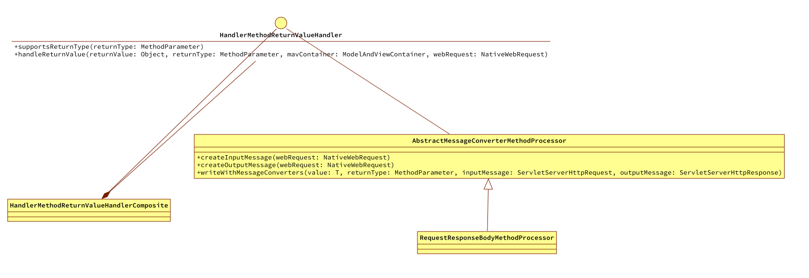
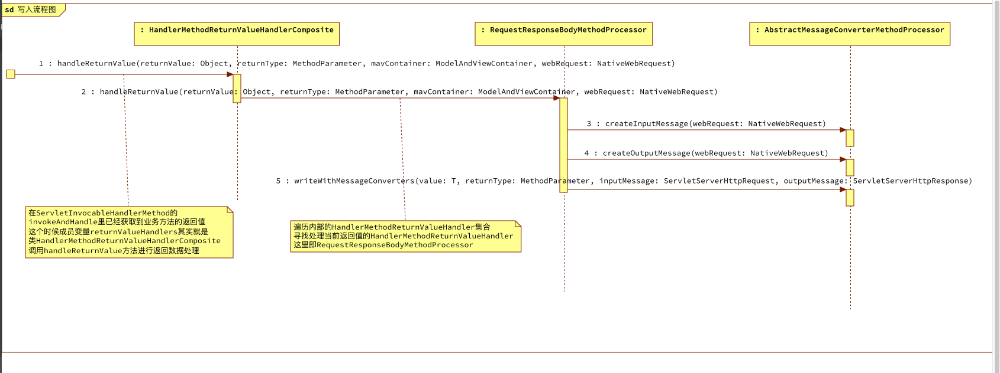

# 前言

到目前为止已经可以匹配当前的HTTP请求并调用获取到业务方法的返回值。由于设定场景是直接获取返回值里格式为JSON类型的数据，所以和`example-httpservlet`类似，将要返回的数据写入到ServletResponse里，同时设定相关格式等信息。

在spring-mvc中这个准备写入的过程是由HandlerMethodReturnValueHandler实现的。这个接口的名称也有意思：

HandlerMethodReturnValueHandler

- HandlerMethod：代表了业务方法
- ReturnValue：即业务方法的返回值
- Handler：业务方法返回值的处理

## 内容概览

- 在RequestMappingHandlerAdapter初始化完成后设置默认的HandlerMethodReturnValueHandler
- HandlerMethodReturnValueHandler体系介绍
- HandlerMethodReturnValueHandler的执行流程

# 设置默认的HandlerMethodReturnValueHandler

HandlerMethodReturnValueHandler的设置是在HandlerAdapter这个Bean初始化完成后设置的。RequestMappingHandlerAdapter实现了InitializingBean接口表示RequestMappingHandlerAdapter这个Bean初始化完成后可以在回调方法里做一些需要的准备工作。

## InitializingBean接口介绍

这个接口不止一次的提到使用了，这里在简单描述下也算是加深印象。

```java
public interface InitializingBean {

	/**
	 * Invoked by the containing {@code BeanFactory} after it has set all bean properties
	 * and satisfied {@link BeanFactoryAware}, {@code ApplicationContextAware} etc.
	 * <p>This method allows the bean instance to perform validation of its overall
	 * configuration and final initialization when all bean properties have been set.
	 * @throws Exception in the event of misconfiguration (such as failure to set an
	 * essential property) or if initialization fails for any other reason
	 */
	void afterPropertiesSet() throws Exception;

}

```

当一个Bean实现该接口，那么当这个Bean在被BeanFactory实例化同时所需要的属性后，这个方法将被回调。可以用来做一些检查工作或者一些其他的初始化，比如这里就做设置HandlerMethodReturnValueHandler的工作。

## RequestMappingHandlerAdapter中设置默认HandlerMethodReturnValueHandler

```java
    @Override
    public void afterPropertiesSet() throws Exception {
        if (this.returnValueHandlers == null) {
          //1.获取默认支持的HandlerMethodReturnValueHandler
            List<HandlerMethodReturnValueHandler> handlers = getDefaultReturnValueHandlers();
            this.returnValueHandlers = new HandlerMethodReturnValueHandlerComposite().addHandlers(handlers);
        }
    }

    private List<HandlerMethodReturnValueHandler> getDefaultReturnValueHandlers() {
        List<HandlerMethodReturnValueHandler> handlers = new ArrayList<>(20);
      //2.简化处理只实现了需要用到的处理器 RequestResponseBodyMethodProcessor，
//        handlers.add(new RequestResponseBodyMethodProcessor(getMessageConverters(),
//                this.contentNegotiationManager, this.requestResponseBodyAdvice));
        handlers.add(new RequestResponseBodyMethodProcessor());

        return handlers;
    }

    @Nullable
    protected ModelAndView invokeHandlerMethod(HttpServletRequest request, HttpServletResponse response, HandlerMethod handlerMethod) throws Exception {

        ServletWebRequest webRequest = new ServletWebRequest(request, response);

        ServletInvocableHandlerMethod invocableMethod = createInvocableHandlerMethod(handlerMethod);

        //3.为invocableMethod设置HandlerMethodReturnValueHandler
        if (this.returnValueHandlers != null) {
            invocableMethod.setHandlerMethodReturnValueHandlers(this.returnValueHandlers);
        }

        ModelAndViewContainer mavContainer = new ModelAndViewContainer();

        //对于@ResponseBody的情况，将调用业务方法，同时将方法返回值放到response的body里
        invocableMethod.invokeAndHandle(webRequest, mavContainer);

        //这里返回一个ModelAndView, 对于@ResponseBody的返回内容已经写进response的body中, 这里要返回null
//        return getModelAndView(mavContainer, modelFactory, webRequest);
        return null;
    }
```

1. 在实现的回调方法afterPropertiesSet里获取支持的HandlerMethodReturnValueHandler
2. 为了简化处理，这里只添加了一个用到的处理器RequestResponseBodyMethodProcessor，同时简化了该处理器的构造方法实现，具体后面写入的时候在完善该处理器
3. 在创建ServletInvocableHandlerMethod后，调用业务方法前设置获取到的HandlerMethodReturnValueHandler

## ServletInvocableHandlerMethod的invokeAndHandle方法里处理业务方法返回值

```java
    public void invokeAndHandle(ServletWebRequest webRequest, ModelAndViewContainer mavContainer,
                                Object... provideArgs) throws Exception {
        //这里会进行业务方法的实际调用
        Object returnValue = invokeForRequest(webRequest, mavContainer, provideArgs);

        Assert.state(this.returnValueHandlers != null, "No return value handlers");
        this.invokeAndHandle.handleReturnValue(
                returnValue, getReturnValueType(returnValue), mavContainer, webRequest);
    }
```

在`08`篇中这里通过控制台输出了业务方法的返回值。现在将业务方法返回值交给invokeAndHandle去处理，准备写入ServletResponse。

# HandlerMethodReturnValueHandler体系介绍

## 体系类结构图



还是相似的配方HandlerMethodReturnValueHandler定义了相关的接口，AbstractMessageConverterMethodProcessor作为抽象实现定义了一系列公共方法，RequestResponseBodyMethodProcessor是真正使用到的特性类。

但是这里的配方有点不同的是HandlerMethodReturnValueHandler对外使用的口子不是具体的特性类，但是一个代理类HandlerMethodReturnValueHandlerComposite。

## HandlerMethodReturnValueHandlerComposite的实现

```java
public class HandlerMethodReturnValueHandlerComposite implements HandlerMethodReturnValueHandler {

    //1.定义了一个HandlerMethodReturnValueHandler集合
    private final List<HandlerMethodReturnValueHandler> returnValueHandlers = new ArrayList<>();

    @Override
    public boolean supportsReturnType(MethodParameter returnType) {
        //2.1遍历集合中的HandlerMethodReturnValueHandler能否支持该返回值类型
        return null != getReturnValueHandler(returnType);
    }

    @Nullable
    private HandlerMethodReturnValueHandler getReturnValueHandler(MethodParameter returnType) {
        for (HandlerMethodReturnValueHandler handler : this.returnValueHandlers) {
            if (handler.supportsReturnType(returnType)) {
                return handler;
            }
        }
        return null;
    }

    @Override
    public void handleReturnValue(Object returnValue, MethodParameter returnType, ModelAndViewContainer mavContainer, NativeWebRequest webRequest) throws Exception {
        //2.2选择一个HandlerMethodReturnValueHandler，进行返回值的处理
        HandlerMethodReturnValueHandler handler = selectHandler(returnValue, returnType);
        if (null == handler) {
            throw new IllegalArgumentException("Unknown return value type: " + returnType.getParameterType().getName());
        }
        handler.handleReturnValue(returnValue, returnType, mavContainer, webRequest);
    }

    @Nullable
    private HandlerMethodReturnValueHandler selectHandler(@Nullable Object value, MethodParameter returnType) {
        for (HandlerMethodReturnValueHandler handler : this.returnValueHandlers) {
            if (handler.supportsReturnType(returnType)) {
                return handler;
            }
        }
        return null;
    }


    public HandlerMethodReturnValueHandlerComposite addHandlers(
            @Nullable List<? extends HandlerMethodReturnValueHandler> handlers) {
        if (null != handlers) {
            this.returnValueHandlers.addAll(handlers);
        }
        return this;
    }
}
```

1. HandlerMethodReturnValueHandlerComposite内部维护了一个HandlerMethodReturnValueHandler集合
2. HandlerMethodReturnValueHandlerComposite同时实现接口HandlerMethodReturnValueHandler
   1. 遍历集合中的HandlerMethodReturnValueHandler能否支持该返回值类型
   2. 遍历集合中的HandlerMethodReturnValueHandler选择一个来完成返回值的处理

## RequestResponseBodyMethodProcessor的实现

```java
public class RequestResponseBodyMethodProcessor extends AbstractMessageConverterMethodProcessor {


    @Override
    public boolean supportsReturnType(MethodParameter returnType) {
        //1.支持被ResponseBody注解标识的方法
        return AnnotatedElementUtils.hasAnnotation(returnType.getContainingClass(), ResponseBody.class) ||
                returnType.hasMethodAnnotation(ResponseBody.class);
    }

    @Override
    public void handleReturnValue(Object returnValue, MethodParameter returnType, ModelAndViewContainer mavContainer, NativeWebRequest webRequest) throws Exception {

        ServletServerHttpRequest inputMessage = createInputMessage(webRequest);
        ServletServerHttpResponse outputMessage = createOutputMessage(webRequest);

        //Try even with null return value. ResponseBodyAdvice could get involved.
        writeWithMessageConverters(returnValue, returnType, inputMessage, outputMessage);
    }
}
```

RequestResponseBodyMethodProcessor作为具体的特性类，老老实实的完成了自己的本质工作。

1. 支持被ResponseBody注解标识的方法
2. 调用父类提供的公共方法进行写操作

## AbstractMessageConverterMethodProcessor的实现

```java
public abstract class AbstractMessageConverterMethodProcessor implements HandlerMethodReturnValueHandler {


    protected ServletServerHttpRequest createInputMessage(NativeWebRequest webRequest) {
        HttpServletRequest servletRequest = webRequest.getNativeRequest(HttpServletRequest.class);
        Assert.state(servletRequest != null, "No HttpServletRequest");
        return new ServletServerHttpRequest(servletRequest);
    }


    protected ServletServerHttpResponse createOutputMessage(NativeWebRequest webRequest) {
        HttpServletResponse response = webRequest.getNativeResponse(HttpServletResponse.class);
        Assert.state(response != null, "No HttpServletResponse");
        return new ServletServerHttpResponse(response);
    }

    protected <T> void writeWithMessageConverters(@Nullable T value, MethodParameter returnType,
                                                  ServletServerHttpRequest inputMessage, ServletServerHttpResponse outputMessage)
            throws IOException, HttpMediaTypeNotAcceptableException, HttpMessageNotWritableException {
      //1.在这里将业务方法返回的数据value写入到HttpServletResponse中
        System.out.println("准备向response里写入响应数据");
    }
}

```

AbstractMessageConverterMethodProcessor做为抽象实现提供了公共方法其中的writeWithMessageConverters方法就是业务方法返回的数据写入HttpServletResponse的核心方法

# 执行流程图



总结下执行的流程

1. 在ServletInvocableHandlerMethod的invokeAndHandle方法里，首先获取到业务方法的返回值。然后由成员变量returnValueHandlers（这里实际上就是HandlerMethodReturnValueHandlerComposite这个类）调用handleReturnValue方法
2. 在HandlerMethodReturnValueHandlerComposite的handleReturnValue遍历维护的HandlerMethodReturnValueHandler集合从中选择一个（这里实际上是RequestResponseBodyMethodProcessor）去执行真正的处理逻辑
3. 在RequestResponseBodyMethodProcessor的handleReturnValue执行方法里调用父类的公共方法进行写入逻辑的组合

# 测试

启动`example-easy-spring`项目调用暴露出来的端点。可以看到业务方法被调用，以及输出返回的结果。

```tex
准备向response里写入响应数据:[beanController, org.springframework.context.annotation.internalConfigurationAnnotationProcessor, org.springframework.context.annotation.internalAutowiredAnnotationProcessor, org.springframework.context.annotation.internalCommonAnnotationProcessor, org.springframework.context.event.internalEventListenerProcessor, org.springframework.context.event.internalEventListenerFactory, org.springframework.web.servlet.mvc.method.annotation.RequestMappingHandlerMapping#0, org.springframework.web.servlet.mvc.method.annotation.RequestMappingHandlerAdapter#0]
```

