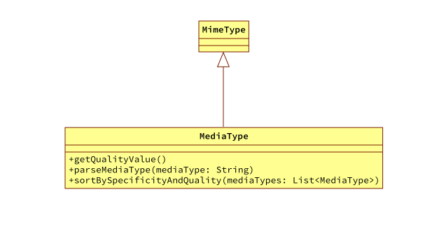
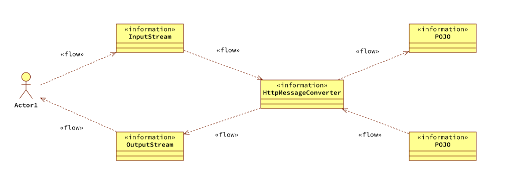
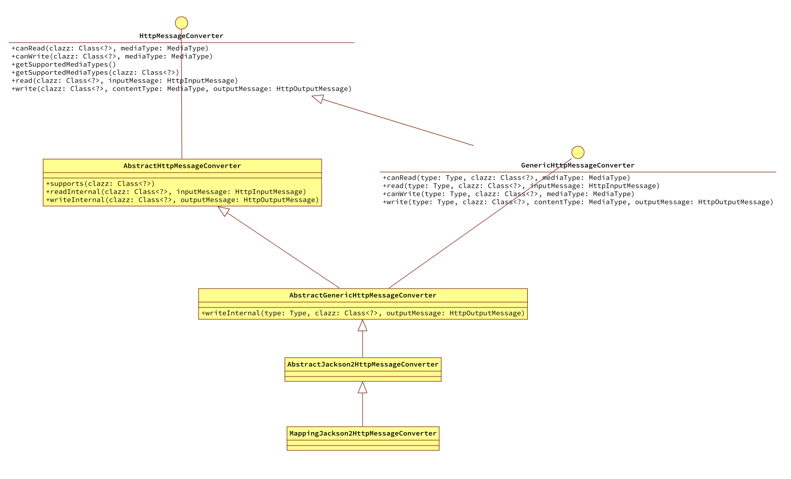
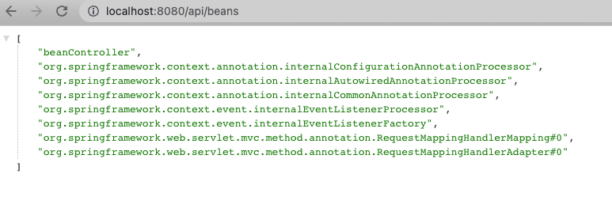

# 前言

铺垫了那么多内容现在就差临门一脚。终于可以将业务接口的返回值写入到Response让调用者使用了。

## 内容概览

- MediaType、MimeType、Content-Type三者的关系
- spring-mvc中的MediaType类
- 在spring-mvc中通过内容协商策略决定MediaType
- HttpMessageConverter体系介绍
- MappingJackson2HttpMessageConverter是怎么完成写入操作的

# 媒体类型

## MediaType、MimeType、Content-Type三者的关系

参考自[stackoverflow](https://stackoverflow.com/questions/9258108/whats-the-difference-between-mediatype-contenttype-and-mimetype)，这三者的关系可以描述如下：

- MimeType和MediaType是一个内容，MimeType是以前的叫法现在叫做MediaType

- Content-Type是在HTTP请求的请求头中指定使用的MediaType

有了这三者的关系，可以总结性认为媒体类型就是用来表示内容的格式，比如可以用来表示 http 请求体和响应体内容的格式。

## spring-mvc中的MediaType类

在spring-mvc中定义了一个MediaType类继承自spring-core模块的MimeType。



### 定义的MediaType类型

在该类中的静态代码块中定义了丰富的内容格式，这里简化只列了目前使用到的一些。

```java
    static {
        ALL = new MediaType("*", "*");
        APPLICATION_JSON = new MediaType("application", "json");
        APPLICATION_OCTET_STREAM = new MediaType("application", "octet-stream");
        TEXT_EVENT_STREAM = new MediaType("text", "event-stream");
    }
```

### 提供的一些方法

在该类中同时也提供了一些常用的工具方法

- getQualityValue获取q值
  - 当有多个内容格式时，可以通过q值指定不同格式的优先级
- parseMediaType从给定的字符串解析为MediaType
- sortBySpecificityAndQuality将多个 MediaType 进行排序，内部会按照 q 参数排序

# 在spring-mvc中通过内容协商策略决定使用的MediaType

在客户端和服务端进行通信时，一个必要的因素是使用什么格式进行通信。就像业务开发中的前后端联调一样有一个商定的过程。

- 客户端可以告诉服务端，希望按照什么样的数据格式返回数据
- 服务端也有自己能够支持的格式

最终会找到一个两者都能接受的格式做为真正使用的通信格式，如果找不到会报错。

**比如：**服务器端可以响应 json 和 xml 格式的数据，而浏览器发送请求的时候告诉服务器说：我能够接收 html 和 json 格式的数据，那么最终会返回二者都能够支持的类型：json 格式的数据。

**再比如：**服务器端可以响应 json 和 html 格式的数据，而客户端发送 http 请求的时候，说自己希望接受 xml 格式的数据，此时服务器端没有能力返回 xml 格式的数据，最终会报错。

## 客户端如何告诉服务端自己期望的数据格式

- 方式 1：http 请求头中使用 Accept 来指定客户端能够接收的类型（又叫：媒体类型）
- 方式 2：自定义的方式 比如请求地址的后缀，test1.xml、test1.json，通过后缀来指定类容类型 比如请求中可以添加一个参数，如 format 来指定能够接收的内容类型

这 2 种方式 SpringMVC 中都有实现，SpringMVC 中默认开启了第 1 种方式，而 SpringBoot 中默认开启了这 2 种方式的支持。

## 如何设置服务端可以响应的数据格式类型

- @RequestMapping 注解的 produces 属性
- response.setHeader("Content-Type","媒体类型");
- 如果上面 2 种方式都不指定，则由 SpringMVC 内部机制自动确定能够响应的媒体类型列表

# 内容协商策略决定MediaType在spring-mvc中的实现

因为MediaType在整个spring-mvc中的实现也是比较复杂的，所以上面对于MediaType的描述更偏向于结论性的没有展开描述。这里的[一篇文章](https://cloud.tencent.com/developer/article/1947976)对于细节描述的更多一些，上面内容也参考了该文章。

下面的代码就是选择最终使用的MediaType的过程。

```java
@SuppressWarnings({"rawtypes", "unchecked"})
    protected <T> void writeWithMessageConverters(@Nullable T value, MethodParameter returnType,
                                                  ServletServerHttpRequest inputMessage, ServletServerHttpResponse outputMessage)
            throws IOException, HttpMediaTypeNotAcceptableException, HttpMessageNotWritableException {

        //......
      
        //确定一个最合适的content-type作为selectedMediaType
        MediaType selectMediaType = null;

        MediaType contentType = outputMessage.getHeaders().getContentType();
        boolean isContentTypePreset = null != contentType && contentType.isConcrete();

        //如果@RequestMapping中的produces配置了content-type，则获取服务器端指定的content-type使用此content-type
        if (isContentTypePreset) {
            selectMediaType = contentType;
        } else {
            //如果没有

            HttpServletRequest request = inputMessage.getServletRequest();
            List<MediaType> acceptableTypes;
            try {
                //获取客户端Accept字段接收的content-type
                acceptableTypes = getAcceptableMediaTypes(request);
            } catch (HttpMediaTypeNotAcceptableException e) {
                throw new RuntimeException(e);
            }

            //获取所有HttpMessageConverter所支持的content-type
            List<MediaType> producibleTypes = getProducibleMediaTypes(request, valueType, targetType);
            if (null != body && producibleTypes.isEmpty()) {
                throw new HttpMessageNotWritableException(
                        "No converter found for return value of type: " + valueType);
            }

            //然后通过acceptableTypes 和producibleMediaTypes 比较得到 mediaTypesToUse
            List<MediaType> mediaTypesToUse = new ArrayList<>();
            for (MediaType requestedType : acceptableTypes) {
                for (MediaType producibleType : producibleTypes) {
                    if (requestedType.isCompatibleWith(producibleType)) {
                        mediaTypesToUse.add(getMostSpecificMediaType(requestedType, producibleType));
                    }
                }
            }
            if (mediaTypesToUse.isEmpty()) {
                if (null != body) {
                    throw new HttpMediaTypeNotAcceptableException(producibleTypes);
                }
                return;
            }

            MediaType.sortBySpecificityAndQuality(mediaTypesToUse);

            for (MediaType mediaType : mediaTypesToUse) {
                if (mediaType.isConcrete()) {
                    selectMediaType = mediaType;
                    break;
                } else if (mediaType.isPresentIn(ALL_APPLICATION_MEDIA_TYPES)) {
                    selectMediaType = MediaType.APPLICATION_OCTET_STREAM;
                    break;
                }
            }
        }
      //......

    }
```

- 获取客户端的content-type，只需解析Accept头字段即可。

- 获取服务器端指定的content-type则分两种情况
  - 在@RequestMapping中指定了produces的content-type类型（会将这一信息存进request的属性中，属性名为HandlerMapping接口名+'.producibleMediaTypes'），如果是这种情况，那么最终使用的就是这个类型。
  - 获取所有的已注册的messageConverter（将内容写入到response的模块，它们负责写所以它们支持不同的类型），获取它们所有的支持的content-type类型，并且过滤掉那些不支持returnValueClass的类型
- 然后在这两组List<MediaType> acceptableTypes和producibleMediaTypes中进行比较匹配（这里的比较规则也挺多的，涉及到q值。），选出一个最合适的content-type，至此有了返回值要写进reponseBody的content-type类型

# HttpMessageConverter体系

HTTP包括请求和响应，即spring-mvc既要处理请求数据同时也要处理响应数据，可以简单认为HttpMessageConverter模块完成了POJO和输入输出流的转换。



- 用户发起请求时转换得到请求参数
- 响应数据时将返回结果写入到响应体

## HttpMessageConverter类体系结构



*还是相同的配方，相同的味道不同的是这次剂量大了些。*

在HttpMessageConverter体系中定义的模版方法比较多，同时方法名也一样（参数不一样），所以梳理起来会比较麻烦。

简单解释下这个类或接口的定位吧：

- HttpMessageConverter定义了读、写以及是否能读、能写相关方法
- AbstractHttpMessageConverter实现了HttpMessageConverter，并完成了部分方法的实现，同时定义了一些模版方法
- GenericHttpMessageConverter定位是一个通用的转换接口，继承自HttpMessageConverter，同时又定义了自己的一些方法
- 到AbstractGenericHttpMessageConverter这里基本上不用处理什么内容了，主要是为通用处理做准备
- AbstractJackson2HttpMessageConverter是一个特性实现，主要是处理JSON的转换，这里完成了大部分转换工作
- MappingJackson2HttpMessageConverter是最终要使用的转换类

## 具体的写入操作

### AbstractJackson2HttpMessageConverter的writeInternal

在这里完成了将业务接口返回内容按照JSON格式写入到response里。

```java
    @Override
    protected void writeInternal(Object object, Type type, HttpOutputMessage outputMessage)
            throws IOException, HttpMessageNotWritableException {
        MediaType contentType = outputMessage.getHeaders().getContentType();
        JsonEncoding encoding = getJsonEncoding(contentType);

        Class<?> clazz = object.getClass();
        ObjectMapper objectMapper = selectObjectMapper(clazz, contentType);
        Assert.state(null != objectMapper, "No ObjectMapper for " + clazz.getName());
        OutputStream outputStream = StreamUtils.nonClosing(outputMessage.getBody());
        try (JsonGenerator generator = objectMapper.getFactory().createGenerator(outputStream, encoding)) {

            ObjectWriter objectWriter = objectMapper.writer();
            SerializationConfig config = objectWriter.getConfig();
            if (null != contentType && contentType.isCompatibleWith(MediaType.TEXT_EVENT_STREAM) &&
                    config.isEnabled(SerializationFeature.INDENT_OUTPUT)) {
                objectWriter = objectWriter.with(this.ssePrettyPrinter);
            }
            objectWriter.writeValue(generator, object);

            generator.flush();
        }

    }
```

# 测试

将MappingJackson2HttpMessageConverter设置使用，在spring配置文件中声明使用的转换器

```xml
    <bean class="org.springframework.web.servlet.mvc.method.annotation.RequestMappingHandlerAdapter">
        <property name="messageConverters">
            <list>
                <bean class="org.springframework.http.converter.json.MappingJackson2HttpMessageConverter"/>
            </list>
        </property>
    </bean>
```


启动服务请求`easy-spring`暴露的端点，响应结果如图所示：

